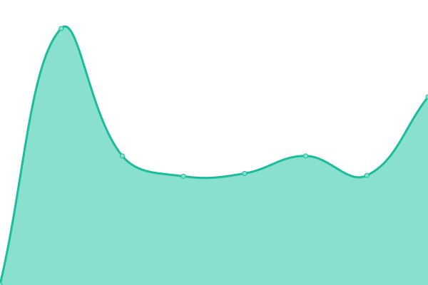
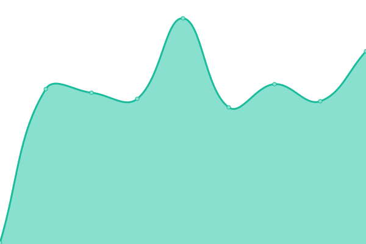
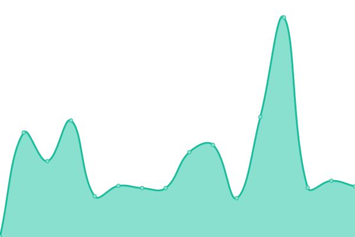
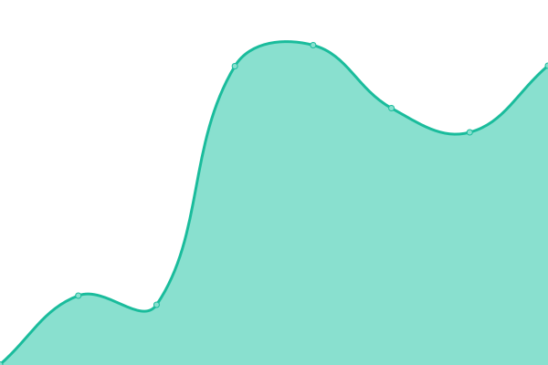
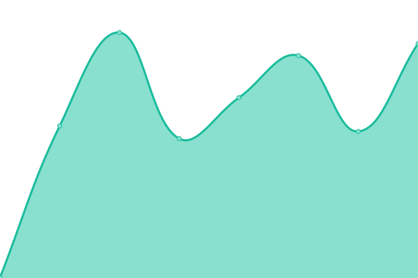
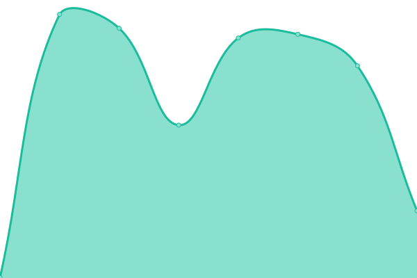
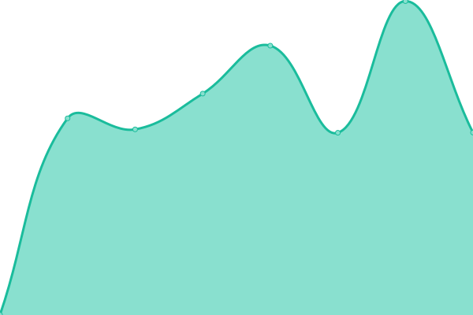
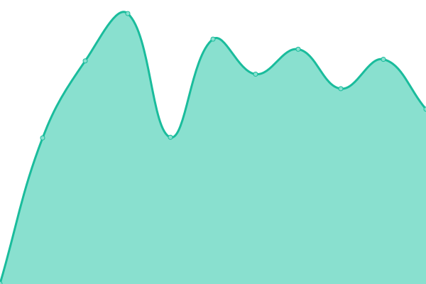
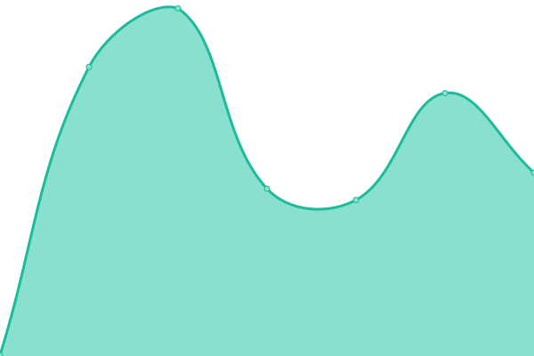
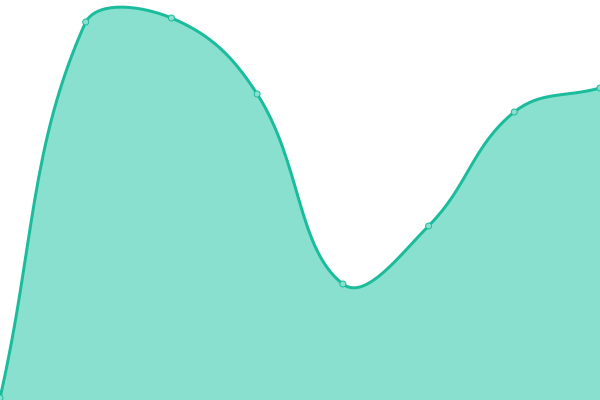

# [📈 Live Status](https://status.k8slens.dev): <!--live status--> **🟩 All systems operational**

This repository contains the open-source uptime monitor and status page for [Lens](https://k8slens.dev/), powered by [Upptime](https://github.com/upptime/upptime).

With [Upptime](https://upptime.js.org), you can get your own unlimited and free uptime monitor and status page, powered entirely by a GitHub repository. We use [Issues](https://github.com/lensapp/k8slens-status/issues) as incident reports, [Actions](https://github.com/lensapp/k8slens-status/actions) as uptime monitors, and [Pages](https://status.k8slens.dev) for the status page.

<!--start: status pages-->
<!-- This summary is generated by Upptime (https://github.com/upptime/upptime) -->
<!-- Do not edit this manually, your changes will be overwritten -->
<!-- prettier-ignore -->
| URL | Status | History | Response Time | Uptime |
| --- | ------ | ------- | ------------- | ------ |
|  [api.k8slens.dev](https://api.k8slens.dev) | 🟩 Up | [api-k8slens-dev.yml](https://github.com/lensapp/k8slens-status/commits/HEAD/history/api-k8slens-dev.yml) | 

 384ms
     
 | 

<a href="https://status.k8slens.dev/history/api-k8slens-dev">100.00%</a>
    

|  [api-docs.k8slens.dev](https://api-docs.k8slens.dev) | 🟩 Up | [api-docs-k8slens-dev.yml](https://github.com/lensapp/k8slens-status/commits/HEAD/history/api-docs-k8slens-dev.yml) | 

 140ms
     
 | 

<a href="https://status.k8slens.dev/history/api-docs-k8slens-dev">100.00%</a>
    

|  [app.k8slens.dev](https://app.k8slens.dev/auth/realms/lensCloud/protocol/openid-connect/3p-cookies/step1.html) | 🟩 Up | [app-k8slens-dev.yml](https://github.com/lensapp/k8slens-status/commits/HEAD/history/app-k8slens-dev.yml) | 

 476ms
     
 | 

<a href="https://status.k8slens.dev/history/app-k8slens-dev">100.00%</a>
    

|  [docs.k8slens.dev](https://docs.k8slens.dev) | 🟩 Up | [docs-k8slens-dev.yml](https://github.com/lensapp/k8slens-status/commits/HEAD/history/docs-k8slens-dev.yml) | 

 116ms
     
 | 

<a href="https://status.k8slens.dev/history/docs-k8slens-dev">100.00%</a>
    

|  [downloads.k8slens.dev](https://downloads.k8slens.dev/ide/latest.yml) | 🟩 Up | [downloads-k8slens-dev.yml](https://github.com/lensapp/k8slens-status/commits/HEAD/history/downloads-k8slens-dev.yml) | 

 389ms
     
 | 

<a href="https://status.k8slens.dev/history/downloads-k8slens-dev">100.00%</a>
    

|  [eu.bored.k8slens.dev](https://eu.bored.k8slens.dev/healthz) | 🟩 Up | [eu-bored-k8slens-dev.yml](https://github.com/lensapp/k8slens-status/commits/HEAD/history/eu-bored-k8slens-dev.yml) | 

 424ms
     
 | 

<a href="https://status.k8slens.dev/history/eu-bored-k8slens-dev">100.00%</a>
    

|  [forums.k8slens.dev](https://forums.k8slens.dev) | 🟩 Up | [forums-k8slens-dev.yml](https://github.com/lensapp/k8slens-status/commits/HEAD/history/forums-k8slens-dev.yml) | 

 508ms
     
 | 

<a href="https://status.k8slens.dev/history/forums-k8slens-dev">100.00%</a>
    

|  [k8slens.dev](https://k8slens.dev) | 🟩 Up | [k8slens-dev.yml](https://github.com/lensapp/k8slens-status/commits/HEAD/history/k8slens-dev.yml) | 

 1497ms
     
 | 

<a href="https://status.k8slens.dev/history/k8slens-dev">100.00%</a>
    

|  [survey.k8slens.dev](https://survey.k8slens.dev/api) | 🟩 Up | [survey-k8slens-dev.yml](https://github.com/lensapp/k8slens-status/commits/HEAD/history/survey-k8slens-dev.yml) | 

 518ms
     
 | 

<a href="https://status.k8slens.dev/history/survey-k8slens-dev">100.00%</a>
    

|  [us.bored.k8slens.dev](https://us.bored.k8slens.dev/healthz) | 🟩 Up | [us-bored-k8slens-dev.yml](https://github.com/lensapp/k8slens-status/commits/HEAD/history/us-bored-k8slens-dev.yml) | 

 166ms
     
 | 

<a href="https://status.k8slens.dev/history/us-bored-k8slens-dev">100.00%</a>
    

|  [checkout.k8slens.dev](https://checkout.k8slens.dev) | 🟩 Up | [checkout-k8slens-dev.yml](https://github.com/lensapp/k8slens-status/commits/HEAD/history/checkout-k8slens-dev.yml) | 

 586ms
     
 | 

<a href="https://status.k8slens.dev/history/checkout-k8slens-dev">100.00%</a>
    

|  [https://k8slens.zendesk.com](https://k8slens.zendesk.com) | 🟩 Up | [https-k8slens-zendesk-com.yml](https://github.com/lensapp/k8slens-status/commits/HEAD/history/https-k8slens-zendesk-com.yml) | 

 295ms
     
 | 

<a href="https://status.k8slens.dev/history/https-k8slens-zendesk-com">100.00%</a>
    

|  [v3.recurly.com](https://v3.recurly.com/subscriptions) | 🟩 Up | [v3-recurly-com.yml](https://github.com/lensapp/k8slens-status/commits/HEAD/history/v3-recurly-com.yml) | 

 172ms
     
 | 

<a href="https://status.k8slens.dev/history/v3-recurly-com">100.00%</a>
    

<!--end: status pages-->

[**Visit our status website →**](https://status.k8slens.dev)

## 📄 License

- Powered by: [Upptime](https://github.com/upptime/upptime)
- Code: [MIT](./LICENSE) © [Lens](https://k8slens.dev/)
- Data in the `./history` directory: [Open Database License](https://opendatacommons.org/licenses/odbl/1-0/)
